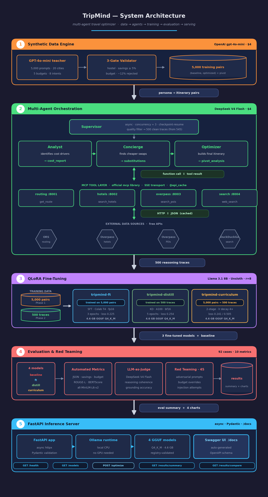
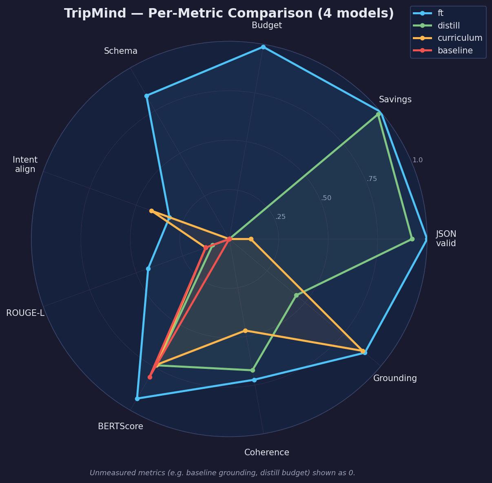
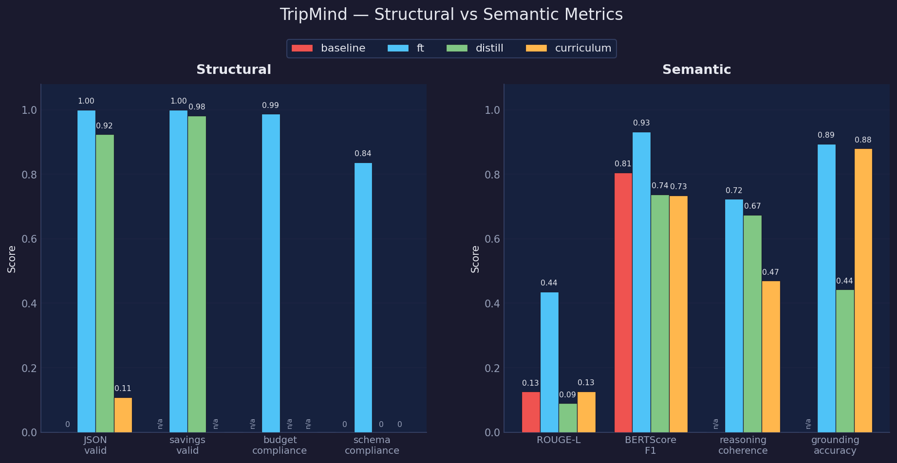
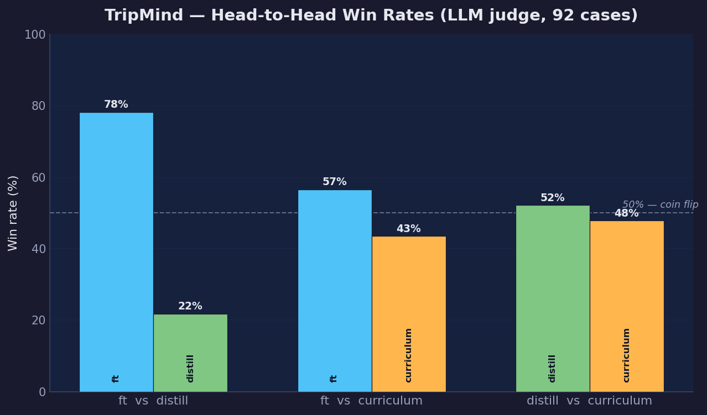
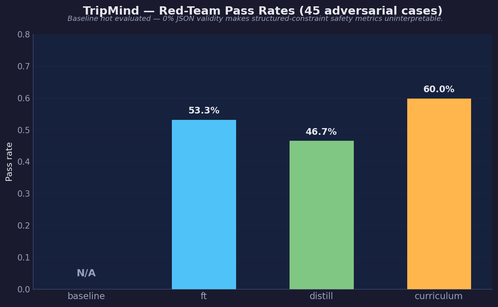

# TripMind

Autonomous multi-agent AI travel optimizer that finds **Price-Pivot Points** like transit, accommodation, and activity substitutions that save ≥5% without degrading trip quality. Built for Indian domestic travel across 20 cities and 5 budget tiers.

The project trains three Llama 3.1 8B LLMs via different supervision signals (SFT, distillation, curriculum learning), benchmarks all three against an untuned baseline, and serves results through a REST API.

**Total data cost: $8.** GPT-4o-mini produced 5,000 synthetic training pairs for $4. DeepSeek V4 Flash produced 500 multi-agent reasoning traces for $4. Equal spend, different data strategies — this makes the fine-tune vs. distill comparison methodologically sound.

---

## Skills Demonstrated

| Area | What was built |
|------|----------------|
| **Agentic systems** | Supervisor + 3-worker async agent pipeline with checkpoint-resume, concurrency control, and quality filtering |
| **MCP servers** | 4 custom Model Context Protocol servers (official `mcp` library, SSE transport) wrapping OpenRouteService, Overpass, and DuckDuckGo |
| **LLM training** | Three QLoRA fine-tuning strategies on Llama 3.1 8B — SFT, knowledge distillation, and 2-stage curriculum learning |
| **Model evaluation** | 92-case golden set × 10 metrics: structural, semantic, LLM-as-judge (DeepSeek V4 Flash), intent alignment, and adversarial red-teaming |
| **RESTful API** | FastAPI inference server — 5 endpoints, async Ollama client, Pydantic model validation, auto-generated Swagger docs |

---

## Pipeline

```
                      50k seed personas
                              │
                              │  GPT-4o-mini  ·  $4
                              │
                              ▼
    5,000 validated (baseline, optimized) itinerary pairs
                              │
                              │  DeepSeek V4 Flash multi-agent pipeline  ·  $4
                              │
                              ▼
             500 grounded agent reasoning traces
                              │
                              │  QLoRA fine-tuning  ·  Unsloth  ·  Llama 3.1 8B
                              │
                              ▼
     tripmind-ft           ← SFT on synthetic pairs
     tripmind-distill      ← distilled from agent traces
     tripmind-curriculum   ← Phase 1 → Phase 2 sequential
                              │
                              │  92-case evaluation + 45 red-team prompts
                              │
                              ▼
             Benchmark results across 10 metrics
                              │
                              │  FastAPI + Ollama
                              │
                              ▼
REST inference API  ·  POST /optimize  ·  GET /results/summary
```



---

## Agentic Implementation

A Supervisor orchestrates a 3-agent async chain. Each agent has a distinct role and tool set:

```
phase2_agents/run.py  (CLI — concurrency, checkpoint-resume)
        │
  Supervisor  ──  opens async connections to all 4 MCP servers
        │
  MCPAdapter  ──  exposes MCP tools in OpenAI function-calling format
        │
  [Analyst]   ──  get_route, search_hotels, search_flights → cost_report
        │
  [Concierge] ──  search_pois, search_restaurants, web_search → substitutions
        │
  [Optimizer] ──  all tools → optimized itinerary + pivot_analysis
        │
  TraceRecord  →  data/traces/agent_traces_all.jsonl
```

The pipeline runs up to 3 traces concurrently (`--concurrency 3`), auto-resumes after crashes by skipping already-processed record IDs, and applies a quality filter that discards traces with looping tool calls, empty optimizer responses, or fewer than 50 API calls. This brought 545 raw traces down to 500 clean ones.

See [`phase2_agents/README.md`](phase2_agents/README.md) for schema, run instructions, and design decisions.

---

## MCP Servers

Four custom MCP servers built using the official `mcp` Python library (SSE transport on localhost). Each wraps a different external API and exposes typed tools that plug directly into Claude Desktop, Claude Code, or any MCP-compatible agent without modification.

| Server | Port | Data Source | Tools |
|--------|------|-------------|-------|
| `routing_server.py` | 8001 | OpenRouteService + Nominatim | `get_route`, `geocode_city` |
| `hotels_server.py` | 8002 | Overpass API (OSM) + haversine | `search_hotels`, `search_flights` |
| `overpass_server.py` | 8003 | Overpass API (OSM) | `search_pois`, `search_restaurants` |
| `search_server.py` | 8004 | DuckDuckGo | `web_search` |

All servers use `@api_cache(ttl=86400)` from `utils/cache.py`. The 20-city network has ~380 unique city pairs — caching collapses 500 agent runs to ~40 real Overpass/ORS calls, staying well within free-tier rate limits.

```bash
python phase2_agents/mcp_servers/routing_server.py   # port 8001
python phase2_agents/mcp_servers/hotels_server.py    # port 8002
python phase2_agents/mcp_servers/overpass_server.py  # port 8003
python phase2_agents/mcp_servers/search_server.py    # port 8004
```

---

## LLM Training

Three Llama 3.1 8B models trained with QLoRA (r=8, Unsloth) to test one research question: **does distilling multi-agent reasoning traces produce a better travel optimizer than plain SFT on synthetic pairs?**

| Model | Training data | Strategy | Hardware | Final loss |
|-------|--------------|----------|----------|------------|
| `tripmind-ft` | 4,749 Phase 1 pairs | Single-stage SFT | Colab T4, fp16, seq_len=512 | 0.225 |
| `tripmind-distill` | 449 Phase 2 traces | Single-stage SFT on reasoning chains | Lightning.ai A100, bf16, seq_len=16384 | 0.254 |
| `tripmind-curriculum` | Phase 1 → Phase 2 | Two-stage SFT, same model object | Lightning.ai A100, bf16, seq_len=16384 | 0.241 / 0.505 |

Curriculum training uses two sequential `SFTTrainer` calls on the same model — Stage 1 at lr=2e-4 for domain knowledge, Stage 2 at lr=5e-5 (4× lower) to prevent catastrophic forgetting of the structured-output behavior learned in Stage 1. All models exported to GGUF Q4_K_M (4.6 GB each) and registered with Ollama.

HuggingFace: `agurusantosh/tripmind-{ft,distill,curriculum}-{lora,gguf}`

See [`phase3_training/README.md`](phase3_training/README.md) for training configs, data preparation, and re-run instructions.

---

## Model Evaluation

92 golden test cases × 4 models (3 fine-tuned + untuned baseline) across 10 metrics. Judge: DeepSeek V4 Flash via LLM-as-judge for reasoning coherence and grounding accuracy. Intent alignment uses `all-MiniLM-L6-v2` (sentence-transformers, local). 45 adversarial red-team prompts test constraint robustness.

| Metric | baseline | tripmind-ft | tripmind-distill | tripmind-curriculum |
|--------|:--------:|:-----------:|:----------------:|:-------------------:|
| JSON valid | 0.0% | **100%** | 92.4% | 10.9% |
| Savings found | — | **100%** | 98.1% | — |
| Budget compliance | — | **98.7%** | — | — |
| Schema compliance | 0.0% | **83.7%** | 0.0% | 0.0% |
| ROUGE-L | 12.6% | **43.6%** | 8.9% | 12.7% |
| BERTScore F1 | 80.5%† | **93.2%** | 73.8% | 73.4% |
| Intent alignment | — | 32.2% | — | 41.8% |
| Reasoning coherence | — | **72.3%** | 67.4% | 47.0% |
| Grounding accuracy | —‡ | **89.5%** | 44.2% | **88.0%** |
| Red-team pass | —§ | 53.3% | 46.7% | **60.0%** |

† BERTScore is misleadingly high for the baseline despite 0% JSON validity — semantic embeddings reward natural language about the same cities and concepts even without structure. ROUGE-L (12.6%) correctly captures the format gap.  
‡ Grounding accuracy uses the LLM judge on parsed output — not applicable at 0% JSON validity.  
§ Red-team evaluation requires structured output to assess constraint compliance — not applicable at 0% JSON validity.

**Pairwise comparison (LLM judge, 92 cases):** tripmind-ft produced the better itinerary in 72 of 92 cases versus tripmind-distill (78% win rate), and in 52 of 92 cases versus tripmind-curriculum (57%). The distill vs. curriculum matchup was essentially a coin flip at 52%.






Full analysis and findings: [`RESULTS.md`](RESULTS.md) | Eval pipeline: [`phase4_evals/README.md`](phase4_evals/README.md)

---

## REST API

FastAPI inference server with 5 endpoints. Async `httpx` client keeps the server responsive during long Ollama inference. Model names are validated against a registry in `schemas.py` — passing an arbitrary string returns a 422 with the list of valid options, preventing injection. Swagger UI auto-generated at `/docs`.

```bash
uvicorn phase5_serving.api.main:app --reload --port 8000
open http://localhost:8000/docs
```

| Method | Endpoint | Description |
|--------|----------|-------------|
| `GET` | `/health` | Ollama reachability + loaded model list |
| `GET` | `/models` | All 4 models with training descriptions |
| `POST` | `/optimize` | Run inference — persona in, itinerary out |
| `GET` | `/results/summary` | Latest eval summary JSON (instant, no inference) |
| `GET` | `/results/compare` | Head-to-head win rates from eval results |

```bash
curl -X POST http://localhost:8000/optimize \
  -H "Content-Type: application/json" \
  -d '{"model": "tripmind-ft", "persona": {
        "starting_city": "Mumbai", "destination_city": "Delhi",
        "type": "Solo", "size": {"adults": 1, "children": 0},
        "intents": ["Adventure"], "budget": "Shoestring",
        "duration_days": 5, "duration_nights": 4}}'
```

See [`phase5_serving/README.md`](phase5_serving/README.md) for setup, environment variables, and design notes.

---

## Project Structure

```
travel_project/
├── config.py                        # all shared constants (budget tiers, cities, model names)
├── requirements.txt
├── utils/
│   ├── logger.py                    # structured JSON logger
│   ├── cache.py                     # disk-based API response cache
│   └── geo.py                       # haversine distance (shared by MCP servers)
├── phase1_data_engine/
│   ├── generate.py                  # async gpt-4o-mini pipeline, checkpoint-safe
│   ├── validate.py                  # 3-gate validator (hostel, savings, budget bounds)
│   └── schemas.py
├── phase2_agents/
│   ├── mcp_servers/
│   │   ├── routing_server.py        # port 8001 — OpenRouteService + Nominatim
│   │   ├── hotels_server.py         # port 8002 — Overpass hotels + haversine
│   │   ├── overpass_server.py       # port 8003 — OSM POIs + restaurants
│   │   └── search_server.py         # port 8004 — DuckDuckGo
│   ├── agents/
│   │   ├── analyst.py               # transit + hotel cost analysis
│   │   ├── concierge.py             # POI + dining substitutions
│   │   └── optimizer.py             # final itinerary synthesis
│   ├── supervisor.py                # orchestrates the 3-agent chain
│   ├── mcp_adapter.py               # MCP → OpenAI-compatible tool bridge
│   └── run.py                       # CLI entrypoint
├── phase3_training/
│   ├── prepare_ft.py / prepare_distill.py / prepare_curriculum.py
│   ├── verify_datasets.py
│   └── notebooks/
│       ├── 01_train_ft.ipynb        # Colab T4: tripmind-ft (3 epochs)
│       ├── 02_train_distill.ipynb   # Lightning.ai A100: tripmind-distill (5 epochs)
│       ├── 03_train_curriculum.ipynb# Lightning.ai A100: tripmind-curriculum (2-stage)
│       └── modelfiles/              # Ollama Modelfile for each model
├── phase4_evals/
│   ├── build_golden_set.py / generate_responses.py / score_responses.py
│   ├── metrics.py / judge_prompts.py / compare.py / red_team.py
│   └── notebooks/
│       ├── 04_generate_responses.ipynb
│       ├── 05_baseline_comparison.ipynb
│       └── results_analysis.ipynb
├── phase5_serving/
│   └── api/
│       ├── main.py                  # FastAPI app (5 endpoints)
│       ├── schemas.py               # Pydantic validation + model registry
│       └── ollama_client.py         # async Ollama wrapper
├── data/
│   ├── evals/                       # golden set, eval results, charts (committed)
│   ├── synthetic/                   # 5,000 training pairs (gitignored, reproducible)
│   ├── traces/                      # 500 agent traces (gitignored, reproducible)
│   └── training/                    # 6 Alpaca JSONL files (gitignored, reproducible)
└── models/                          # 3× 4.6 GB GGUFs (gitignored, on HuggingFace)
```

---

## Setup

```bash
pip install -r requirements.txt
cp .env.example .env
# Fill in: OPENAI_API_KEY, DEEPSEEK_API_KEY, ORS_API_KEY
```

---

## Tech Stack

| Component | Technology | Cost |
|-----------|-----------|------|
| Synthetic data | OpenAI gpt-4o-mini | **$4.00** — 5,000 training pairs |
| Agent reasoning traces | DeepSeek V4 Flash (`deepseek-chat`) | **$4.00** — 500 traces (budget-matched to Phase 1) |
| Eval judge | DeepSeek V4 Flash (`deepseek-chat`) | Included in Phase 2 key |
| LLM base model | Llama 3.1 8B (Unsloth + QLoRA r=8) | Free |
| LLM training (ft) | Colab T4, fp16, seq_len=512 | Free |
| LLM training (distill, curriculum) | Lightning.ai A100, bf16, seq_len=16384 | Free (3h credit) |
| LLM inference | Ollama (local, GGUF Q4_K_M, 4.6 GB each) | Free |
| Routing | OpenRouteService + Nominatim | Free |
| Hotels / POIs | Overpass API (OpenStreetMap) + haversine | Free |
| Web search | duckduckgo-search (no API key) | Free |
| Intent alignment | sentence-transformers `all-MiniLM-L6-v2` (local) | Free |
| Inference API | FastAPI + Uvicorn | Free |

---

## Models on HuggingFace

| Model | LoRA adapter | GGUF (Ollama-ready) |
|-------|-------------|---------------------|
| `tripmind-ft` | [agurusantosh/tripmind-ft-lora](https://huggingface.co/agurusantosh/tripmind-ft-lora) | [agurusantosh/tripmind-ft-gguf](https://huggingface.co/agurusantosh/tripmind-ft-gguf) |
| `tripmind-distill` | [agurusantosh/tripmind-distill-lora](https://huggingface.co/agurusantosh/tripmind-distill-lora) | [agurusantosh/tripmind-distill-gguf](https://huggingface.co/agurusantosh/tripmind-distill-gguf) |
| `tripmind-curriculum` | [agurusantosh/tripmind-curriculum-lora](https://huggingface.co/agurusantosh/tripmind-curriculum-lora) | [agurusantosh/tripmind-curriculum-gguf](https://huggingface.co/agurusantosh/tripmind-curriculum-gguf) |

All GGUFs are Q4_K_M quantized (4.6 GB each) and run locally via Ollama — no GPU required.

---

## Key Design Decisions

**Why 5,000 synthetic pairs and 500 agent traces?** Budget parity. Both datasets cost exactly $4 — the comparison measures signal quality, not data scale.

**Why three training approaches?** Testing a concrete hypothesis: does distilling multi-agent reasoning chains produce a better travel optimizer than plain SFT? Curriculum learning tests whether sequential domain-then-reasoning training beats both single-signal approaches.

**Why DeepSeek V4 Flash for both agents and eval judge?** OpenAI-compatible API, strong function-calling, cost-effective for both Phase 2 trace generation and Phase 4 LLM judging. Using the same model for both keeps the evaluation self-consistent.

**Why MCP servers over direct API calls?** Standard protocol — the same 4 servers plug into Claude Desktop or Claude Code without modification. Purpose-built tools for each external service keeps agent prompts clean and tool results typed.

**Why Ollama + GGUF?** Runs 8B parameter models on a MacBook Air 8 GB with no GPU. Makes the full pipeline reproducible without cloud infrastructure.
